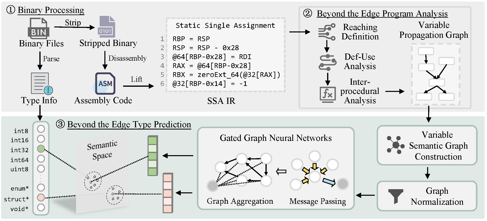

### Overview

*ByteTR* is a framework designed for recovering variable types in binary code. It utilizes inter-procedural program analysis to construct variable semantic graphs and employs graph neural networks to restore variable types.

<p align="center">
  
</p>

### Project

#### 1. EmpiricalAnalysis

Conduct empirical analysis experiments on binary code using the following commands.

- Type Frequency
- Zipf's and Heaps' Laws
- Pattern of Storage

```
$ pushd EmpiricalAnalysis/<EXP>/
$ python step1.py
$ python step2.py
$ popd
```

The following experiments require IDA, which we have encapsulated in a Docker container (IDA 9.0).

- Number of Functions
- Number of Variables
- Locality of Reference

```
$ pushd EmpiricalAnalysis/<EXP>/
$ docker run \
    -it \
    -v <TYDA_DATASET>:/dataset/ \
    -v $(pwd)/idascript:/idascript \
    --rm \
    docker/ida
# cd /idascript && python launcher.py
# exit
$ python step1.py
$ python step2.py
$ popd
```

#### 2. BinaryProcessing

First, configure `binary.config.json` and `public.config.json` in the `config` directory. Then, navigate to the `BinaryProcessing` folder and follow the steps to process the binary files. `<ARCH>` and `<OPT>` specify the architecture and optimization options, respectively.

```
$ pushd BinaryProcessing/
$ python step0.selectELF.py \
    --arch <ARCH> \
    --opt <OPT>
$ python step1.parseDwarfInfo.py \
    --arch <ARCH> \
    --opt <OPT>
$ python step2.parseCfiInfo.py \
    --arch <ARCH> \
    --opt <OPT>
```

#### 3. BytePA

Next, first merge the DWARF and CFI information of the variables via `step3`, then use `step4` to construct the graph structure representations of the variables based on this information.

```
$ python step3.postProcess.py \
    --arch <ARCH> \
    --opt <OPT>
$ python step4.generateSDG.py \
    --arch <ARCH> \
    --opt <OPT>
```

#### 4. ByteTP

Next, process the dataset and perform tokenization of the graph nodes and edges. Finally, we train the model.

```
$ pushd BinaryProcessing/
$ python preprocess.py \
    --arch <ARCH> \
    --opt <OPT>
$ CUDA_VISIBLE_DEVICES=0 python train.py \
    --arch x86_64 \
    --opt O0 \
    --lr 0.0001 \
    --nepoch 200 \
    --batch_size 32 \
    --feature_dim 128 \
    --gate_agg add \
    --global_agg max \
    --layer_GRU 3 \
    --layer_GNN 3 \
    --checkpoint_dir checkpoints
```

#### Note

To implement the export of DWARF types as a type chain, I modified elftools/dwarf/datatype_cpp.py. Additionally, to support the System V calling convention for ELF, I modified /miasm/arch/{x86, aarch64, mips32}/lifter_model_call.py. For specific details, please refer to [here](BinaryProcessing/patch).
